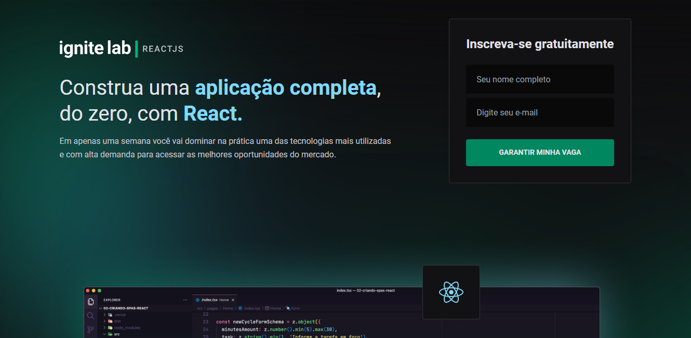
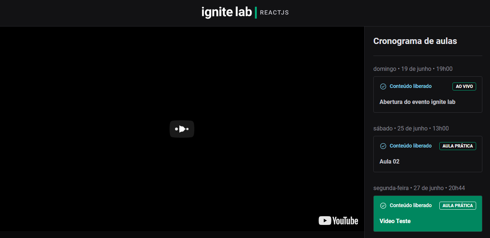

<h1 align='center'>Event Plataform</h1>
<h3 align='center'>
  <a href="#tecnologias">Tecnologias</a> |
  <a href="#sobre">Sobre</a> |
  <a href="#imagens">Images</a> |
  <a href="#pre-requisitos">Ver o projeto</a>
</h3>

# Tecnologias

Para a construção do projeto utilizei as seguintes tecnologias:

  <ul> 
    <li>Tailwind</li>
    <li>TypeScript</li>
    <li>React</li>
    <li>React - Dom</li>
    <li>React - Router</li>
    <li>GraphQL</li>
    <li><a href="https://graphcms.com/" target="_blank">GraphCMS</a></li>
    <li>Apollo</li>
    <li>Codegen</li>
    <li>Phosphoricons - biblioteca de icones</li>
  </ul>

# Sobre

<p>
  O projeto é a criação de uma plataforma de eventos gerenciavel por meio de um cms.
</p>
<p> Criado para o IgniteLab da <a target="_blank" href="https://www.rocketseat.com.br/">Rocketseat.</a></p>

## Funcionalidades

- [X]Inscrição de novos usuários
- [X]Visualização dos videos
- [X]Status de cada video
- [X]Integração com CMS
- [X]Consumo de Api GraphQL

# Imagens

## Home


<hr/>

## Pagina do evento


<hr/>

# Pre-requisitos

Para testar o projeto na sua maquina você irá precisar das seguintes ferramentas:
[Git](https://git-scm.com/), [Node](https://nodejs.org/en/). Além disso é ideal usar um bom editor para trabalhar com código como o [VSCode](https://code.visualstudio.com/)

```bash
#Clone este repositorio

$ git clone <https://github.com/eduardoluizdev/ignite-feed>

#Lembre-se de acessar a pasta do projeto

$ cd ignite-feed

#Assim que estiver na pasta, adicione o seguinte comando
#Dessa forma as dependencias da aplicação serão baixadas e o projeto podera funcionar corretamente.

$ npm install

#Agora basta iniciar o projeto

$ npm run dev

#O servidor inciará na porta:3000 - acesse <http://localhost:3000>
```

#### Feito por Vitor para o Ignite Lab 👍
